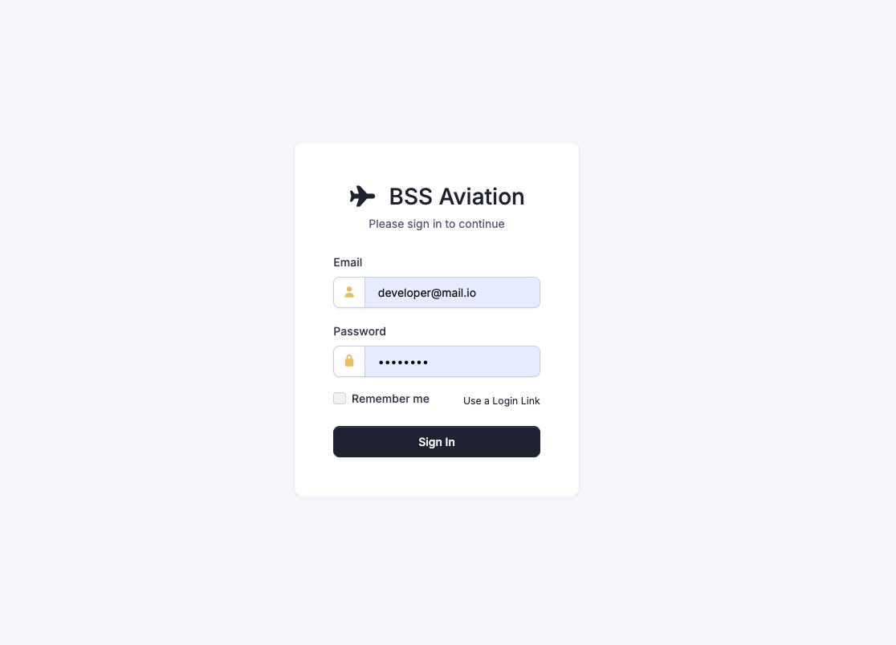
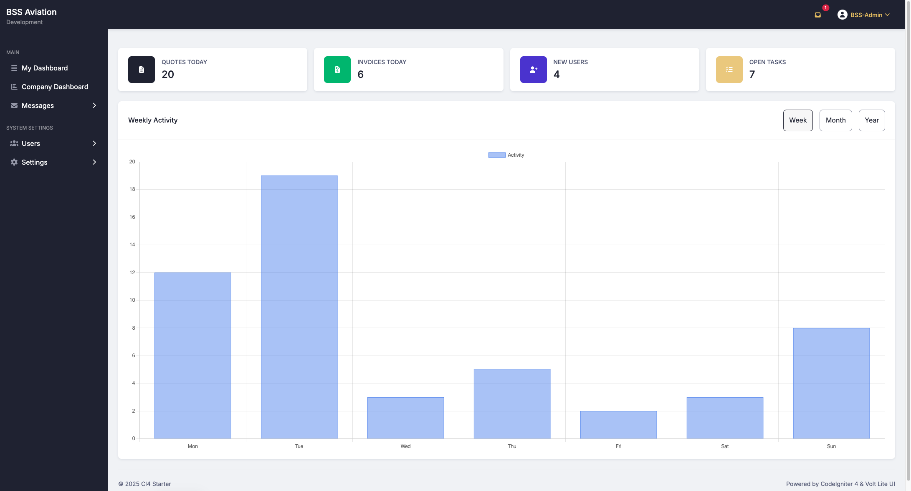
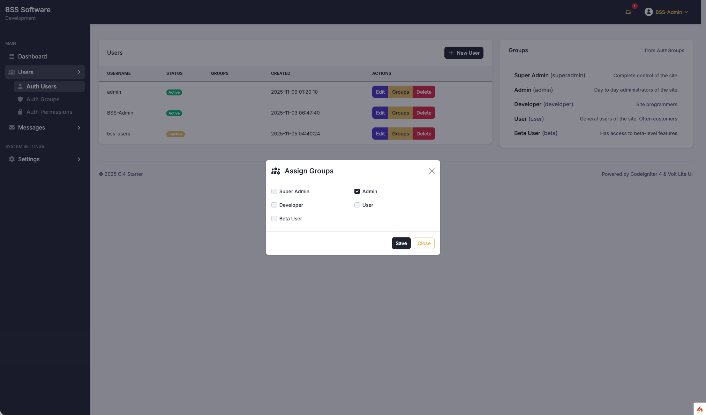

# 📦 **CI4 Starter – CodeIgniter 4.6.3 Boilerplate (PHP 8.3)**

A modern, production-ready **CodeIgniter 4.6.3 starter kit** designed for building secure, scalable, enterprise-grade web applications.
Includes a robust authentication system powered by **CodeIgniter Shield**, a permission-aware sidebar menu system, a clean Bootstrap-based UI, reusable backend helpers, DataTables integration, and a developer-friendly structure ready for real business applications.

This project serves as a solid foundation for ERP systems, admin dashboards, internal business platforms, and modular multi-feature applications.

---

## **Features**

### **Core Framework & Architecture**

* Built on **CodeIgniter 4.6.3** (latest stable version)
* PHP **8.3** compatible
* Clean and organized MVC structure
* Reusable `BaseModel`, traits, helpers, and service extensions
* Cache-buster helper for automatic asset versioning
* Environment-ready (`.env.example`, debug settings, development/production modes)
* Modular and scalable directory structure

---

### **Authentication & Authorization (Shield)**

* Integrated **CodeIgniter Shield 1.2.0**
* Secure login, logout, and session handling
* Role-based and permission-based access control
* Route protection using filters and aliases
* Developer-friendly: extendable identities, permissions, and user metadata
* Designed to support OAuth providers in the future (placeholder for expansion)

---

### **Dynamic Sidebar Menu System**

* Fully permission-aware dynamic menu
* Role-based menu visibility
* Organized into categories and sub-menus
* Icon support for visual clarity
* Easily extendable for modules, dashboards, or custom features
* Database-driven for long-term flexibility

---

### **UI / Frontend Features**

* Bootstrap-based layout (clean, professional, Volt-inspired styling)
* Font Awesome icon pack included
* Responsive multi-pane layout (top-nav + sidebar)
* Prebuilt UI patterns:

  * Modals
  * Confirmation dialogs
  * Alerts & notifications
* **SweetAlert2** integrated for toasts and confirmations
* Custom CSS structure under `/assets/` with cache-busting support

---

### **DataTables Integration**

* Server-side processing ready
* Expandable child rows (invoice lines, quote lines, etc.)
* Column sorting, filtering, pagination
* Clean JS utilities for:

  * CSRF token refresh
  * AJAX abstraction
  * Table teardown & reinitialization
* Page-specific scripts to avoid global pollution

---

### **Developer Experience**

* Clean project structure for fast onboarding
* `spark` commands ready for future expansion
* Supports PHPUnit (Feature & Unit tests)
* Page-specific JavaScript organization for clean separation of concerns
* Consistent naming conventions
* Designed for maintainability and long-term upgrades
* Modular backend patterns for controllers, models, filters, helpers

---

### **Backend Utilities**

* Centralized settings using **CodeIgniter Settings 2.2.0**
* Reusable custom helpers (`site()`, CSRF helpers, string utilities, etc.)
* Custom BaseModel with:

  * Automatic timestamps
  * Soft deletes
  * Dynamic validation rule structures
* Optional audit logging structure
* Preconfigured MySQL integration

---

### **Security**

* CSRF protection applied globally
* Hardened session handling
* Shield-based route protection
* Secure password hashing & user management
* Safe route grouping with explicit filters

---

### **Ideal Use Cases**

This starter is perfect for building:

* Admin dashboards
* Inventory or ERP systems
* Internal company portals
* Multi-module business apps
* Quote / invoice management systems
* CRUD-based enterprise platforms
* Any long-term CI4 project requiring structure and security

---

## **Directory Structure Overview**

```
app/
├── Config/            # App-level configuration
├── Controllers/       # HTTP controllers
├── Models/            # Database models
├── Views/             # Bootstrap-based UI views
├── Helpers/           # Custom helper functions
├── Filters/           # Shield filters, auth protection
├── Libraries/         # Extendable backend utilities
└── ...
public/
├── assets/            # CSS, JS, images (cache-busted)
└── index.php          # Entry point
writable/
├── cache/
├── logs/
└── uploads/
```

---

## **Requirements**

* **PHP 8.1+** (recommended PHP 8.3)
* **MySQL 5.7+ / MariaDB**
* Composer
* Apache/Nginx with mod_rewrite enabled

---

## **Installation**

```bash
git clone https://github.com/YOUR_USERNAME/ci4-starter.git
cd ci4-starter

composer install
cp env.example .env
php spark key:generate
php spark migrate
php spark db:seed
```

Configure your `.env` database settings:

```
database.default.hostname = localhost
database.default.database = ci4starter
database.default.username = root
database.default.password = root
database.default.DBDriver = MySQLi
```

Serve the app:

```bash
php spark serve
```

Open:
**[http://localhost:8080](http://localhost:8080)**

---

## **Default Login (Demo Seed)**

```
Email: developer@mail.io
Password: 123456
Role: Developer
```

(Modify or remove this section if publishing publicly.)

---

## Screenshots

### **Authentication & Dashboard**

| Login | Dashboard |
|-------|-----------|
|  |  |

---

### **Navigation & Data Management**

| Sidebar Menu | DataTables (Server-Side) |
|--------------|--------------------------|
|  |  |

---

### **Forms & Modals**

| Modal Form |
|------------|
|  |


---

## **Roadmap**

* [ ] Complete OAuth provider integration
* [ ] Upgrade to Bootstrap 5.x
* [ ] Optional Tailwind/Flowbite/Alpine variant
* [ ] Expand Settings module
* [ ] Add demo modules (Users, Roles, Activity Logs, etc.)
* [ ] Add CLI generators
* [ ] Add PHPUnit feature tests

---

## **Contributing**

1. Fork the repo
2. Create a new feature branch
3. Commit changes
4. Submit a pull request

Issues and suggestions are welcome!

---

## **License**

MIT — feel free to use this starter in personal or commercial projects.

---

## **Credits**

Built with ❤️ using **CodeIgniter 4**, **Shield**, **Bootstrap**, and developer-focused best practices.

